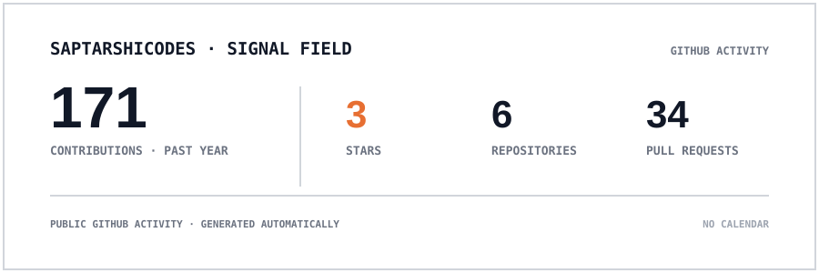
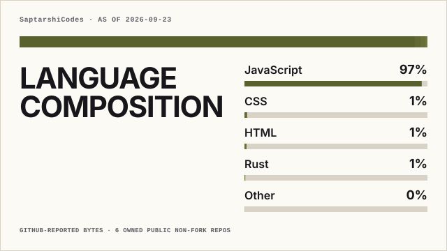
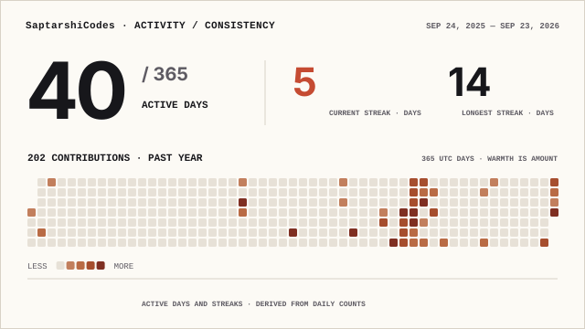

# Hi, I'm Saptarshi Manna 👋

### Software Developer | Full-Stack Development | Data Structures & Algorithms

I'm an **Information Technology undergraduate at Jadavpur University** passionate about building scalable web applications, solving algorithmic problems, and exploring AI-powered solutions.

I enjoy turning ideas into practical products — from full-stack applications and real-time systems to data-driven platforms and intelligent software.

---

## 🚀 About Me

* 🎓 B.E. in Information Technology @ **Jadavpur University**
* 💻 Focused on **Full-Stack Development & Data Structures and Algorithms**
* 🧠 Exploring **AI/ML and intelligent software systems**
* 🌐 Building applications with the **MERN ecosystem**
* ⚡ Interested in **system design, scalable backends, and developer tools**
* 🏆 **WBJEE Rank:** 505
* 📈 **Codeforces Rating:** 1200
* 🧩 **200+ DSA problems solved**
* 🔭 Currently working on **AI-powered and full-stack projects**
* 📍 West Bengal, India

---

## 🛠️ Tech Stack

### Languages

<p>
  
  
  
  
  
  
</p>


### Frontend

<p>
  
  
  
  
</p>

### Backend & Databases

<p>
  
  
  
  
  
</p>

### Tools & Technologies

<p>
  
  
  
  
</p>

---

## 💻 Featured Projects

### 🔹 Real-Time Chat Application

**MERN Stack · Socket.IO · JWT · MongoDB**

A real-time communication platform designed with a scalable client-server architecture.

**Key features:**

* Real-time messaging using Socket.IO
* JWT-based authentication
* User sessions and online communication
* RESTful backend architecture
* Persistent data storage with MongoDB

---

### 🔹 Coding Platform

**React · Node.js · Judge0 · Monaco Editor**

A browser-based coding platform that allows users to write, execute, and evaluate code.

**Key features:**

* Monaco-based code editor
* Multi-language code execution
* Judge0 integration
* Problem-based coding environment
* Test-case evaluation
* LeetCode-inspired output experience

---

### 🔹 MPLADS Risk Monitor

**React · Python · FastAPI · PostgreSQL · PostGIS · Machine Learning**

An AI-powered platform designed to identify potential **anomalies, fraud patterns, and inefficiencies** in public development projects.

The platform combines:

* 📊 Risk scoring
* 🗺️ Geospatial visualization
* 🤖 Anomaly detection
* 🔎 Entity resolution
* 🧠 Semantic similarity
* 📑 Evidence-based explanations
* 📈 Interactive analytics

---

## 🧠 Data Structures & Algorithms

I regularly practice competitive programming and problem solving.

### Current Focus

* Arrays & Strings
* Hashing
* Two Pointers
* Sliding Window
* Binary Search
* Linked Lists
* Stacks & Queues
* Trees & Graphs
* Dynamic Programming
* Greedy Algorithms
* Recursion & Backtracking
* Graph Algorithms

### Competitive Programming

**200+ problems solved**

**Codeforces:** `1200+ Rating`

<!-- LeetCode -->
  <a href="https://leetcode.com/u/saptarshi_codes/">
    
  </a>

  <!-- Codeforces -->
  <a href="https://codeforces.com/profile/Saptarshi_codes">
    
  </a>

I'm continuously working toward improving both my problem-solving skills and ability to write efficient, maintainable code.

---

## 📊 GitHub Stats

<p align="center">
  <picture>
    <source
      media="(prefers-color-scheme: dark)"
      srcset="./profile/signal-field-wide-dark.svg"
    >
    
  </picture>
</p>

---

## 💻 Language Composition

<p align="center">
  <picture>
    <source
      media="(prefers-color-scheme: dark)"
      srcset="./profile/language-composition-wide-dark.svg"
    >
    
  </picture>
</p>

---

## 📈 Contribution Activity

<p align="center">
  <picture>
    <source
      media="(prefers-color-scheme: dark)"
      srcset="./profile/activity-consistency-wide-dark.svg"
    >
    
  </picture>
</p>

---

## 🎯 What I'm Currently Learning

```text
Full-Stack Development
        ↓
System Design
        ↓
Advanced DSA
        ↓
AI / Machine Learning
        ↓
Scalable & Intelligent Applications
```

I'm particularly interested in understanding how **software engineering, data, and AI can work together to solve real-world problems.**

---

## 🤝 Let's Connect

<p align="left">
   <a href="mailto:mannasaptarshi1@gmail.com">
    
  </a>
  <a href="https://github.com/SaptarshiCodes">
    
  </a>
  <a href="https://www.linkedin.com/in/saptarshi-manna-ju28/">
    
  </a>
</p>

---

### 💡 "Build. Break. Learn. Repeat."

I'm always interested in **interesting projects, open-source contributions, hackathons, and opportunities to build meaningful technology.**

⭐ If you find any of my projects useful, consider giving them a star!
